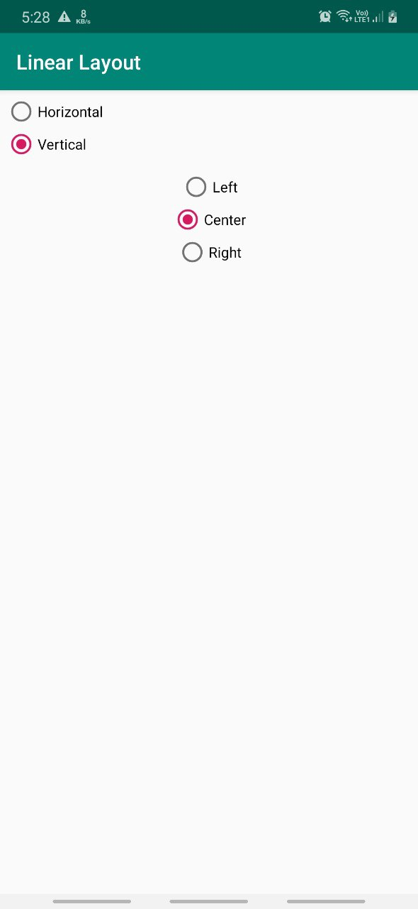
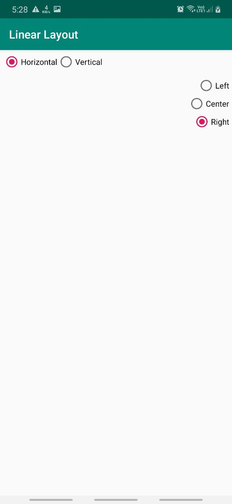

## Linear Layout

Android, through LinearLayout , offers a *"box" model*, and
supports a range of containers providing different layout rules.

*LinearLayout* is a box model – widgets or child containers
are lined up in a column or row, one after the next.

To configure a LinearLayout , there are five main areas of control besides the container's contents: 
1. The orientation
2. The fill model
3. The  weight
4. The gravity
5. The padding

**1. Orientation**\
Orientation indicates whether the *LinearLayout* represents a row or a
column. Just add the `android:orientation` property to your LinearLayout
element in your XML layout, setting the value to be *horizontal* for a row or *vertical* for a column. The orientation can be modified at runtime by invoking `setOrientation()` on the LinearLayout, supplying it either *HORIZONTAL* or *VERTICAL*.

**2. Fill Model**\
To decide what to do with the remaining space, all the widgets inside a LinearLayout must supply `android:layout_width` and `android:layout_height` properties. These properties' values have three flavors:
- Provide a specific dimension, such as *125dip* to indicate the
widget should take up exactly a certain size
- Provide *wrap_content*, which means the widget should fill
up its natural space, unless that is too big, in which case Android
can use word-wrap as needed to make it fit
- Provide *match_parent*, which means the widget should fill up
all available space in its enclosing container, after all other widgets
are taken care of

**3. Weight**\
This property indicates what proportion of the free space should go to a widget. The weight for a widget is zero by default.

Another pattern for using weights is if you want to allocate sizes on a
percentage basis. To use this technique for, say, a horizontal layout:
- Set all the `android:layout_width` values to be 0 for the widgets in the
layout
- Set the `android:layout_weight` values to be the desired percentage
size for each widget in the layout
- Make sure all those weights add up to 100

**4. Gravity**\
How the widget and its container is aligned vis-à-vis the screen.

**5. Margins & Padding**\
Specifies how tightly the widgets are packed.

Adding padding will increase the space between the contents (e.g., the caption of a Button ) and the edges, while adding margin increases the empty space between the edges and adjacent widgets.

**Example**

