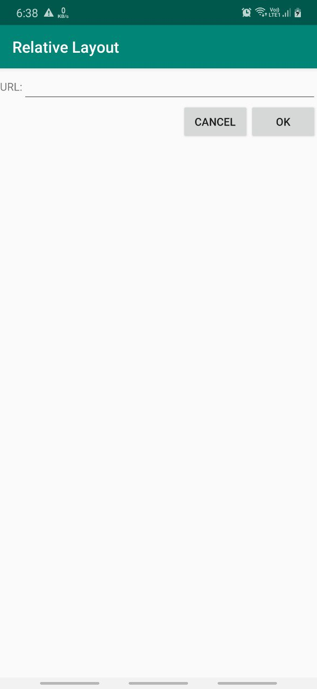

## Relative Layout

RelativeLayout , as the name suggests, lays out widgets based upon their relationship to other widgets in the container and the parent container.

**Positions Relative to Container**\
The easiest relations to set up are tying a widget's position to that of its container:
- `android:layout_alignParentTop` / `android:layout_alignParentBottom` / `android:layout_alignParentLeft` / `android:layout_alignParentRight` says the widget's top should align with the top/bottom/left/right of the container
- `android:layout_centerHorizontal` / `android:layout_centerVertical`says the widget
positioned horizontally/vertically at the center of the container
- `android:layout_centerInParent` says the widget should be positioned
both horizontally and vertically at the center of the container

All of these properties take a simple boolean value ( true or false ). 

**Positions Relative to Other Widgets**\
There are four properties that control position of a widget vis a vis other
widgets:
- `android:layout_above`
- `android:layout_below`
- `android:layout_toLeftOf`
- `android:layout_toRightOf`

Indicates that the widget should be placed
above/below/left/right of the widget referenced in the property

Beyond those four, there are five additional properties that can control one widget's alignment relative to another:
indicates that the widget's top should be
aligned with the top of the widget referenced in the property
- `android:layout_alignTop`
- `android:layout_alignBottom`
- `android:layout_alignLeft`
- `android:layout_alignRight` 

Indicates that the widget's right should be aligned with the top/bottom/left/right of the widget referenced in the property
- `android:layout_alignBaseline` indicates that the baselines of the two
widgets should be aligned (where the "baseline" is that invisible line
that text appears to sit on).

The last one is useful for aligning labels and fields so that the text appears
"natural".

Note that The first occurrence of an id value should have the plus sign
( `@+id/widget_a` ); the second and subsequent times that id value is used in
the layout file should drop the plus sign ( `@id/widget_a` ).

**Example**

