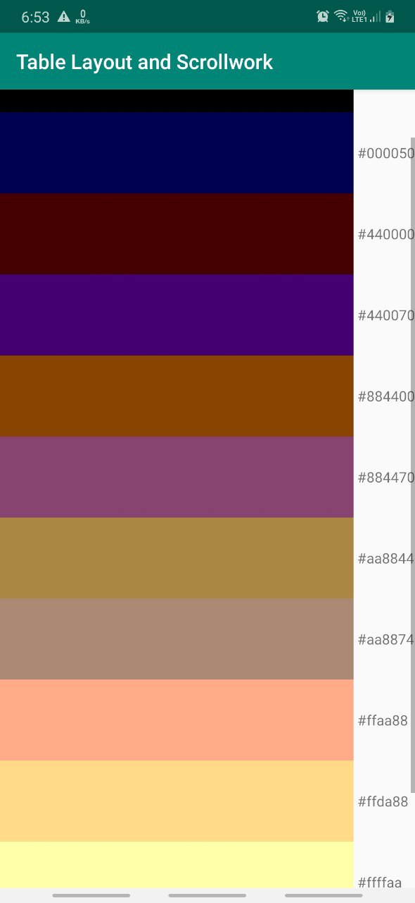

## Table Layout

*TableLayout* works in conjunction with *TableRow*. *TableLayout* controls the overall behavior of the container, with the widgets themselves poured into one or more TableRow containers, one per row in the grid.
Rows are declared by the developer, by putting widgets as children of a
*TableRow* inside the overall TableLayout. Developer, therefore, control directly how
many rows appear in the table. \
The number of columns are determined by Android; you control the
number of columns in an indirect fashion. \

A widget can take up more than one column by including the
`android:layout_span` property.
A widget can be put into a different column via the `android:layout_column` property. 

Normally, *TableLayout* contains only *TableRow* elements as immediate children. However, it is possible to put other widgets in between rows. For those widgets, TableLayout behaves a bit like LinearLayout with vertical orientation. The widgets automatically have their width set to fill_parent , so they will fill the same space that the longest row does. \
Other properties are:
`android:stretchColumns`, `android:shrinkColumns`, `android:collapseColumns`.
Programmatically,
you can collapse and un-collapse columns by calling `setColumnCollapsed()` on the TableLayout and can also control stretching and shrinking at runtime via `setColumnStretchable()` and `setColumnShrinkable()`.

**Scrollwork**

*ScrollView* is a container that provides scrolling for its contents. You can take a layout that might be too big for some screens, wrap it in a *ScrollView*, and still use your existing layout logic.

*HorizontalScrollView*, works like *ScrollView*, just horizontally. This would be good for forms that might be too wide rather than too tall.

**Example**

