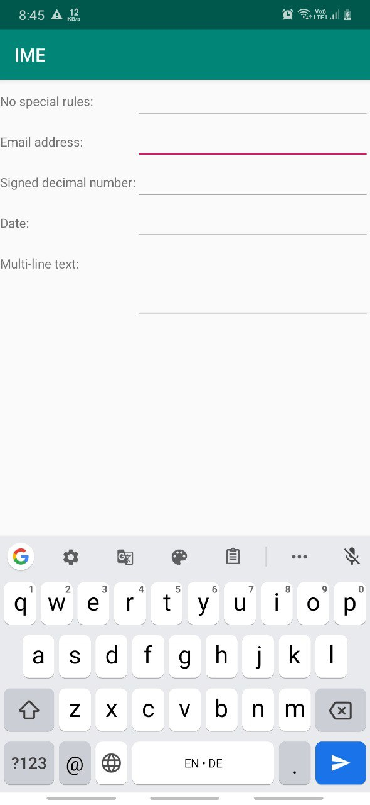
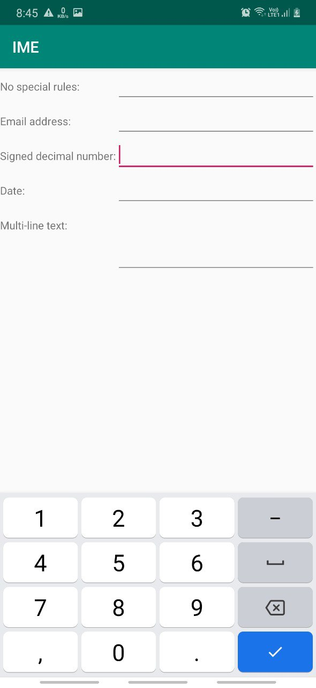

## The Input Method Framework

The IMF handles input. If there is no hardware keyboard, an input method editor (IME) will be available to the user when they tap on an enabled *EditText*.

By choosing the appropriate `android:inputType`, you can give the user a soft keyboard that best suits what it is they should be entering. The `android:inputType` attribute takes a class plus modifiers, in a pipe-delimited list (where | is the pipe character). The class generally describes what the user is allowed to input, and this determines the basic set of keys available on the soft keyboard.\
The available classes are:
- text (the default)
- number
- phone
- datetime
- date
- time

The class and modifiers tailor the keyboard.

**Tell Android Where It Can Go**\
How to control what goes on with that lower-right-hand button, called the accessory button?

By default, on an EditText where the `android:inputType` is specified, the accessory button will be "Next", moving focus to the next *EditText* in sequence, or "Done", if  on the last EditText on the screen. To stipulate manually what the accessory button will be labeled, the `android:imeOptions` attribute is used.

what happens to activity's own layout when the input method editor appears?

There are three possibilities, depending on circumstances:
- Android can "pan" your activity. This has the effect of hiding some portion of the UI.
- Android can resize your activity, effectively causing it to shrink to a smaller screen dimension, allowing the input method editor to sit below the activity itself. 
- In landscape mode, Android may display the input method editor full-screen, obscuring your entire activity. This allows for a bigger keyboard and generally easier data entry.

Android controls the **full-screen** option purely on its own. And, by default, Android will choose between pan and resize modes depending on what the layout looks like. If you want to specifically choose between pan and resize, do so via an `android:windowSoftInputMode` attribute on the `<activity>` element in the *AndroidManifest.xml* file.

To **hide the editor**, you will need to make a call to the `InputMethodManager`, a
system service that controls these input method editors. This will always close the input method editor. 

